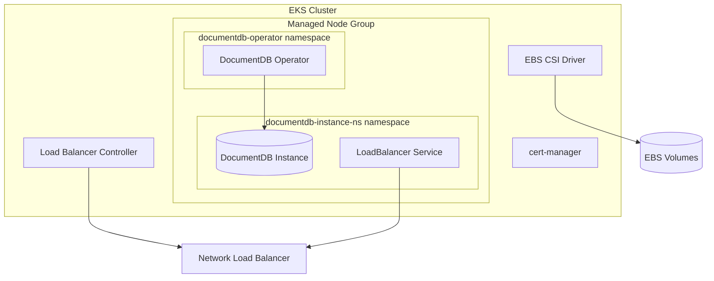

# Deploy DocumentDB on AWS EKS

This guide walks you through deploying the DocumentDB Kubernetes Operator on Amazon Elastic Kubernetes Service (EKS). You can use the automated playground scripts for a quick setup or follow the manual steps for more control.

## Overview

The deployment creates:

- An EKS cluster with managed node groups
- EBS CSI driver for persistent storage
- AWS Load Balancer Controller for external access
- cert-manager for TLS certificate management
- Optimized storage classes for DocumentDB



## Prerequisites

### Required Tools

| Tool | Version | Purpose | Installation |
|------|---------|---------|--------------|
| AWS CLI | 2.x | AWS authentication and resource management | [Install AWS CLI](https://docs.aws.amazon.com/cli/latest/userguide/getting-started-install.html) |
| eksctl | 0.160+ | EKS cluster creation and management | [Install eksctl](https://eksctl.io/installation/) |
| kubectl | 1.32+ | Kubernetes cluster interaction (must match EKS version) | [Install kubectl](https://kubernetes.io/docs/tasks/tools/) |
| Helm | 3.x | Package management for Kubernetes | [Install Helm](https://helm.sh/docs/intro/install/) |
| jq | 1.6+ | JSON processing (optional) | `apt install jq` or `brew install jq` |

### AWS Configuration

1. **Configure AWS CLI** with appropriate credentials:

    ```bash
    aws configure
    ```

    You'll need:
    - AWS Access Key ID
    - AWS Secret Access Key
    - Default region (for example, `us-west-2`)
    - Default output format (for example, `json`)

2. **Verify credentials**:

    ```bash
    aws sts get-caller-identity
    ```

### Helm Repository Setup

The DocumentDB operator Helm chart is available from the public GitHub Pages repository.

```bash
helm repo add documentdb https://documentdb.github.io/documentdb-kubernetes-operator
helm repo update
```

## Quick Start with Playground Scripts

The fastest way to deploy DocumentDB on EKS is using the automation scripts in [`documentdb-playground/aws-setup`](https://github.com/documentdb/documentdb-kubernetes-operator/tree/main/documentdb-playground/aws-setup).

### Deploy Everything

```bash
# Clone the repository
git clone https://github.com/documentdb/documentdb-kubernetes-operator.git
cd documentdb-kubernetes-operator/documentdb-playground/aws-setup

# Create cluster with operator and sample instance
./scripts/create-cluster.sh --deploy-instance
```

This single command:

1. Creates an EKS cluster with 2 `m5.large` nodes
2. Installs EBS CSI driver, Load Balancer Controller, and cert-manager
3. Creates optimized storage classes
4. Installs the DocumentDB operator
5. Deploys a sample DocumentDB instance with external LoadBalancer access

!!! note "Provisioning Time"
    The full deployment takes approximately 20-30 minutes. EKS cluster creation is the longest step (~15 minutes).

### Script Options

The `create-cluster.sh` script supports several options:

```bash
# Create cluster only (no operator)
./scripts/create-cluster.sh

# Create cluster with operator (no instance)
./scripts/create-cluster.sh --install-operator

# Custom cluster name and region
./scripts/create-cluster.sh --cluster-name my-docdb --region us-east-1 --deploy-instance

# View all options
./scripts/create-cluster.sh --help
```

| Option | Description | Default |
|--------|-------------|---------|
| `--cluster-name NAME` | EKS cluster name | `documentdb-cluster` |
| `--region REGION` | AWS region | `us-west-2` |
| `--install-operator` | Install operator only (no instance) | `false` |
| `--deploy-instance` | Install operator and deploy sample instance | `false` |

### Clean up

!!! danger "Cost Warning"
    EKS clusters incur charges even when idle. The estimated cost is **$140-230/month**. Always delete resources when done testing.

```bash
# Delete everything (EKS cluster, operator, DocumentDB instances)
./scripts/delete-cluster.sh

# Delete only DocumentDB instances (keep EKS cluster for reuse)
./scripts/delete-cluster.sh --instance-only

# Delete DocumentDB instances and operator (keep EKS cluster infrastructure)
./scripts/delete-cluster.sh --instance-and-operator
```

## Manual Deployment

For production deployments or when you need more control, follow these manual steps.

### Step 1: Create EKS cluster

```bash
export CLUSTER_NAME="documentdb-cluster"
export REGION="us-west-2"

eksctl create cluster \
    --name $CLUSTER_NAME \
    --region $REGION \
    --version 1.32 \
    --node-type m5.large \
    --nodes 2 \
    --nodes-min 1 \
    --nodes-max 4 \
    --managed \
    --with-oidc
```

### Step 2: Install EBS CSI Driver

The EBS CSI driver enables dynamic provisioning of EBS volumes for persistent storage.

```bash
# Create IAM service account for EBS CSI
eksctl create iamserviceaccount \
    --cluster $CLUSTER_NAME \
    --namespace kube-system \
    --name ebs-csi-controller-sa \
    --attach-policy-arn arn:aws:iam::aws:policy/service-role/AmazonEBSCSIDriverPolicy \
    --approve \
    --region $REGION

# Install EBS CSI driver addon
eksctl create addon \
    --name aws-ebs-csi-driver \
    --cluster $CLUSTER_NAME \
    --region $REGION \
    --force

# Verify installation
kubectl get pods -n kube-system -l app=ebs-csi-controller
```

### Step 3: Install AWS Load Balancer Controller

The Load Balancer Controller manages AWS Network Load Balancers for Kubernetes services.

```bash
# Get EKS cluster VPC ID
VPC_ID=$(aws eks describe-cluster \
    --name $CLUSTER_NAME \
    --region $REGION \
    --query 'cluster.resourcesVpcConfig.vpcId' \
    --output text)

# Download IAM policy
curl -o /tmp/iam_policy.json \
    https://raw.githubusercontent.com/kubernetes-sigs/aws-load-balancer-controller/main/docs/install/iam_policy.json

# Create IAM policy
ACCOUNT_ID=$(aws sts get-caller-identity --query Account --output text)
aws iam create-policy \
    --policy-name AWSLoadBalancerControllerIAMPolicy \
    --policy-document file:///tmp/iam_policy.json

# Create IAM service account
eksctl create iamserviceaccount \
    --cluster=$CLUSTER_NAME \
    --namespace=kube-system \
    --name=aws-load-balancer-controller \
    --role-name "AmazonEKSLoadBalancerControllerRole-$CLUSTER_NAME" \
    --attach-policy-arn=arn:aws:iam::$ACCOUNT_ID:policy/AWSLoadBalancerControllerIAMPolicy \
    --approve \
    --region=$REGION

# Install Load Balancer Controller via Helm
helm repo add eks https://aws.github.io/eks-charts
helm repo update eks

helm install aws-load-balancer-controller eks/aws-load-balancer-controller \
    -n kube-system \
    --set clusterName=$CLUSTER_NAME \
    --set serviceAccount.create=false \
    --set serviceAccount.name=aws-load-balancer-controller \
    --set region=$REGION \
    --set vpcId=$VPC_ID

# Verify installation
kubectl get deployment -n kube-system aws-load-balancer-controller
```

### Step 4: Install cert-manager

cert-manager handles TLS certificate provisioning and renewal.

```bash
helm repo add jetstack https://charts.jetstack.io
helm repo update

helm install cert-manager jetstack/cert-manager \
    --namespace cert-manager \
    --create-namespace \
    --version v1.13.2 \
    --set installCRDs=true

# Verify installation
kubectl get pods -n cert-manager
```

### Step 5: Create storage class

Create an optimized storage class for DocumentDB workloads:

```yaml title="documentdb-storage-class.yaml"
apiVersion: storage.k8s.io/v1
kind: StorageClass
metadata:
  name: documentdb-storage
provisioner: ebs.csi.aws.com
parameters:
  type: gp3           # (1)!
  iops: "3000"        # (2)!
  throughput: "125"   # (3)!
  fsType: ext4
  encrypted: "true"   # (4)!
allowVolumeExpansion: true
volumeBindingMode: WaitForFirstConsumer  # (5)!
reclaimPolicy: Retain  # (6)!
```

1. `gp3` provides baseline performance at lower cost than `io1`
2. Baseline IOPS for gp3 volumes (can increase up to 16,000)
3. Throughput in MiB/s (can increase up to 1,000)
4. Encrypts data at rest using AWS KMS
5. Delays volume binding until pod is scheduled (enables zone-aware placement)
6. Retains volumes when PVC is deleted (data protection)

Apply the storage class:

```bash
kubectl apply -f documentdb-storage-class.yaml
```

### Step 6: Install DocumentDB Operator

```bash
# Add the Helm repository
helm repo add documentdb https://documentdb.github.io/documentdb-kubernetes-operator
helm repo update

# Install the operator
helm install documentdb-operator documentdb/documentdb-operator \
    --namespace documentdb-operator \
    --create-namespace \
    --wait

# Verify installation
kubectl get pods -n documentdb-operator
```

### Step 7: Deploy DocumentDB instance

Create a namespace and credentials secret:

```bash
kubectl create namespace documentdb-instance-ns

kubectl create secret generic documentdb-credentials \
    --namespace documentdb-instance-ns \
    --from-literal=username=docdbadmin \
    --from-literal=password='YourSecurePassword123'
```

Deploy a DocumentDB instance:

```yaml title="documentdb-instance.yaml"
apiVersion: documentdb.io/preview
kind: DocumentDB
metadata:
  name: my-documentdb
  namespace: documentdb-instance-ns
spec:
  environment: eks          # (1)!
  nodeCount: 1
  instancesPerNode: 1
  documentDbCredentialSecret: documentdb-credentials
  resource:
    storage:
      pvcSize: 10Gi
      storageClass: documentdb-storage
  exposeViaService:
    serviceType: LoadBalancer  # (2)!
  advanced:
    sidecarInjectorPluginName: cnpg-i-sidecar-injector.documentdb.io
```

1. Setting `environment: eks` automatically applies AWS-specific LoadBalancer annotations
2. Creates a Network Load Balancer for external access

```bash
kubectl apply -f documentdb-instance.yaml
```

## AWS-specific storage classes

EKS supports several EBS volume types. Choose based on your performance requirements:

| Volume Type | Use Case | IOPS | Throughput | Cost |
|-------------|----------|------|------------|------|
| `gp3` | General purpose, most workloads | 3,000-16,000 | 125-1,000 MiB/s | $ |
| `gp2` | Legacy general purpose | Linked to size | Linked to size | $ |
| `io1` | High-performance, critical workloads | Up to 64,000 | Up to 1,000 MiB/s | $$$ |
| `io2` | Highest durability (99.999%) | Up to 64,000 | Up to 1,000 MiB/s | $$$ |

!!! tip "Recommendation"
    Use `gp3` for most workloads. It provides consistent baseline performance and allows independent scaling of IOPS and throughput without increasing volume size.

### High-performance storage class

For production workloads requiring higher IOPS:

```yaml title="documentdb-storage-high-perf.yaml"
apiVersion: storage.k8s.io/v1
kind: StorageClass
metadata:
  name: documentdb-storage-high-perf
provisioner: ebs.csi.aws.com
parameters:
  type: gp3
  iops: "10000"
  throughput: "500"
  fsType: ext4
  encrypted: "true"
allowVolumeExpansion: true
volumeBindingMode: WaitForFirstConsumer
reclaimPolicy: Retain
```

## Network Load Balancer Configuration

When `environment: eks` is specified in the DocumentDB spec, the operator automatically applies these NLB annotations to the generated Kubernetes Service:

```yaml
# Annotations applied to the Service resource
metadata:
  annotations:
    service.beta.kubernetes.io/aws-load-balancer-type: "nlb"
    service.beta.kubernetes.io/aws-load-balancer-scheme: "internet-facing"
    service.beta.kubernetes.io/aws-load-balancer-cross-zone-load-balancing-enabled: "true"
    service.beta.kubernetes.io/aws-load-balancer-nlb-target-type: "ip"
```

| Annotation | Value | Description |
|------------|-------|-------------|
| `aws-load-balancer-type` | `nlb` | Use Network Load Balancer (Layer 4) |
| `aws-load-balancer-scheme` | `internet-facing` | Create public-facing LB with external IP |
| `aws-load-balancer-cross-zone-load-balancing-enabled` | `true` | Distribute traffic across all AZs |
| `aws-load-balancer-nlb-target-type` | `ip` | Route directly to pod IPs (required for service mesh) |

!!! note "LoadBalancer Provisioning"
    AWS takes 2-5 minutes to provision the Network Load Balancer and assign a public IP address.

### Internal Load Balancer

For private access within your VPC, the operator automatically applies internal LB annotations when `environment: eks` is set. To customize annotations beyond the defaults, you can create your own Kubernetes Service resource that targets the DocumentDB pods.

!!! note "Custom Annotations"
    The current API applies cloud-specific annotations automatically based on the `environment` field. For advanced customization, manage the Service resource separately from the DocumentDB CR.

## Verification

### Check EKS cluster status

```bash
# Verify nodes are ready
kubectl get nodes

# Check all system pods
kubectl get pods -n kube-system

# Verify operator is running
kubectl get pods -n documentdb-operator
```

### Check DocumentDB instance

```bash
# Check DocumentDB instance status
kubectl get documentdb -n documentdb-instance-ns

# Get detailed status
kubectl describe documentdb my-documentdb -n documentdb-instance-ns

# Check pods
kubectl get pods -n documentdb-instance-ns
```

### Get connection information

```bash
# Wait for LoadBalancer IP
kubectl get svc -n documentdb-instance-ns -w

# Get the external IP (once assigned)
EXTERNAL_IP=$(kubectl get svc documentdb-service-my-documentdb \
    -n documentdb-instance-ns \
    -o jsonpath='{.status.loadBalancer.ingress[0].hostname}')

echo "Connection string: mongodb://docdbadmin:YourSecurePassword123@${EXTERNAL_IP}:10260/"
```

### Test connection

```bash
# Using mongosh (if installed)
mongosh 'mongodb://docdbadmin:YourSecurePassword123@'"${EXTERNAL_IP}"':10260/'

# Or using kubectl exec into the pod
kubectl exec -it -n documentdb-instance-ns \
    $(kubectl get pods -n documentdb-instance-ns -l documentdb.io/cluster=my-documentdb -o name | head -1) \
    -- mongosh --eval "print('Connection successful')"
```

## Troubleshooting

### EBS CSI Driver Issues

**Symptom:** PVCs stuck in `Pending` state

```bash
# Check CSI driver pods
kubectl get pods -n kube-system -l app=ebs-csi-controller

# Check CSI driver logs
kubectl logs -n kube-system -l app=ebs-csi-controller -c csi-provisioner

# Verify IAM permissions
eksctl get iamserviceaccount --cluster $CLUSTER_NAME --region $REGION
```

**Common causes:**

- Missing IAM role attachment for the CSI service account
- EBS CSI addon not fully installed
- Insufficient IAM permissions

### Load balancer not created

**Symptom:** Service shows `<pending>` for EXTERNAL-IP

```bash
# Check Load Balancer Controller logs
kubectl logs -n kube-system -l app.kubernetes.io/name=aws-load-balancer-controller

# Verify subnet tags
aws ec2 describe-subnets --filters "Name=tag:kubernetes.io/role/elb,Values=1" \
    --query 'Subnets[].SubnetId' --region $REGION
```

**Common causes:**

- Missing subnet tags for load balancer discovery
- IAM policy missing required permissions
- VPC configuration issues

### DocumentDB pod not starting

**Symptom:** Pods stuck in `Pending` or `CrashLoopBackOff`

```bash
# Check pod events
kubectl describe pod -n documentdb-instance-ns -l documentdb.io/cluster=my-documentdb

# Check operator logs
kubectl logs -n documentdb-operator -l app.kubernetes.io/name=documentdb-operator

# Check PVC status
kubectl get pvc -n documentdb-instance-ns
```

### cert-manager Issues

**Symptom:** TLS certificates not being issued

```bash
# Check cert-manager pods
kubectl get pods -n cert-manager

# Check certificate requests
kubectl get certificaterequests -A

# Check cert-manager logs
kubectl logs -n cert-manager -l app.kubernetes.io/name=cert-manager
```

### Helm chart authentication issues

**Symptom:** Unable to pull the DocumentDB operator Helm chart from the public repository

If the public Helm repository is unavailable or you encounter authentication errors, you can use GitHub Container Registry (GHCR) with a Personal Access Token as a fallback:

```bash
# Create a GitHub Personal Access Token with read:packages scope
# Go to: https://github.com/settings/tokens → Generate new token (classic)
# Select scope: read:packages

# Set credentials
export GITHUB_USERNAME="your-github-username"
export GITHUB_TOKEN="ghp_xxxxxxxxxxxxxxxxxxxx"

# Authenticate with GitHub Container Registry
echo "$GITHUB_TOKEN" | helm registry login ghcr.io \
    --username "$GITHUB_USERNAME" \
    --password-stdin

# Install using OCI registry
helm install documentdb-operator \
    oci://ghcr.io/documentdb/documentdb-operator \
    --namespace documentdb-operator \
    --create-namespace \
    --wait
```

!!! note "Version Pinning with OCI"
    When using the OCI registry, you may need to specify a version with `--version`. Check the [releases page](https://github.com/documentdb/documentdb-kubernetes-operator/releases) for available versions.

## Cost Optimization

### Right-size node groups

For development/testing, use smaller instances:

```bash
# Use smaller instance type for dev/test
eksctl create cluster \
    --name $CLUSTER_NAME \
    --region $REGION \
    --version 1.32 \
    --node-type t3.medium \
    --nodes 2
```

### Use Spot Instances

For non-production workloads:

```bash
eksctl create nodegroup \
    --cluster $CLUSTER_NAME \
    --region $REGION \
    --name spot-nodes \
    --node-type m5.large \
    --nodes 2 \
    --spot
```

### Clean up unused resources

```bash
# Delete DocumentDB instances when not in use
kubectl delete documentdb --all -n documentdb-instance-ns

# Or delete the entire EKS cluster
eksctl delete cluster --name $CLUSTER_NAME --region $REGION
```

## Related Resources

- [AWS EKS Documentation](https://docs.aws.amazon.com/eks/)
- [EBS CSI Driver](https://github.com/kubernetes-sigs/aws-ebs-csi-driver)
- [AWS Load Balancer Controller](https://kubernetes-sigs.github.io/aws-load-balancer-controller/)
- [Playground Scripts](https://github.com/documentdb/documentdb-kubernetes-operator/tree/main/documentdb-playground/aws-setup)
