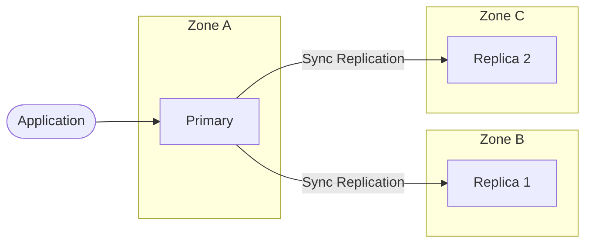
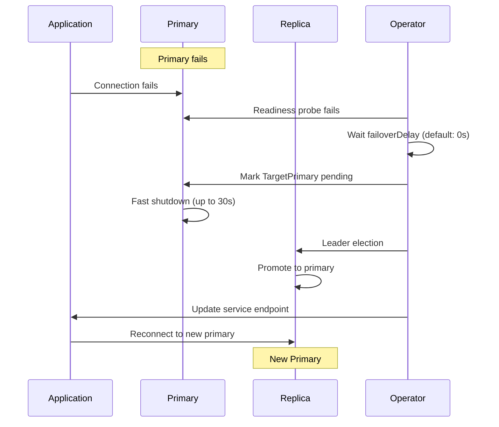

# Local High Availability

Local high availability (HA) deploys multiple DocumentDB instances within a single Kubernetes cluster, providing automatic failover and zero data loss during instance failures.

## Overview

Local HA uses synchronous replication between a primary instance and one or two replicas. When the primary fails, a replica is automatically promoted to primary.



## Instance Configuration

Configure the number of instances using the `instancesPerNode` field:

```yaml title="documentdb-ha.yaml"
apiVersion: documentdb.io/preview
kind: DocumentDB
metadata:
  name: my-documentdb
  namespace: documentdb
spec:
  instancesPerNode: 3  # (1)!
  storage:
    size: 10Gi
    storageClassName: managed-csi
```

1. Valid values: `1` (no HA), `2` (primary + 1 replica), `3` (primary + 2 replicas, recommended for production)

### Instance Count Options

| Instances | Configuration | Use Case |
|-----------|---------------|----------|
| `1` | Single instance, no replicas | Development, testing |
| `2` | Primary + 1 replica | Cost-sensitive production |
| `3` | Primary + 2 replicas | **Recommended** for production |

!!! tip "Why 3 instances?"
    Three instances provide quorum-based failover. With 2 instances, the system cannot distinguish between a network partition and a failed primary. With 3 instances, the system can achieve consensus and safely promote a replica.

## Pod Anti-Affinity

Pod anti-affinity ensures DocumentDB instances are distributed across failure domains (nodes, zones) for resilience.

### Zone-Level Distribution (Recommended)

Distribute instances across availability zones:

```yaml title="documentdb-zone-affinity.yaml"
apiVersion: documentdb.io/preview
kind: DocumentDB
metadata:
  name: my-documentdb
  namespace: documentdb
spec:
  instancesPerNode: 3
  affinity:
    enablePodAntiAffinity: true
    topologyKey: topology.kubernetes.io/zone  # (1)!
```

1. Distributes pods across different availability zones. Requires a cluster with nodes in multiple zones.

### Node-Level Distribution

For clusters without multiple zones, distribute across nodes:

```yaml title="documentdb-node-affinity.yaml"
apiVersion: documentdb.io/preview
kind: DocumentDB
metadata:
  name: my-documentdb
  namespace: documentdb
spec:
  instancesPerNode: 3
  affinity:
    enablePodAntiAffinity: true
    topologyKey: kubernetes.io/hostname  # (1)!
```

1. Distributes pods across different nodes. Requires at least 3 nodes in the cluster.

### Affinity Configuration Reference

| Field | Type | Description |
|-------|------|-------------|
| `enablePodAntiAffinity` | boolean | Enable/disable pod anti-affinity |
| `topologyKey` | string | Kubernetes topology label for distribution |
| `podAntiAffinityType` | string | `preferred` (default) or `required` |

!!! warning "Required vs Preferred"
    Using `required` anti-affinity prevents scheduling if constraints cannot be met. Use `preferred` (default) to allow scheduling even when ideal placement isn't possible.

## Automatic Failover

DocumentDB uses CloudNative-PG's failover mechanism to automatically detect primary failure and promote a replica. No manual intervention is required for local HA failover.

### Failover Timeline



### Failover Timing Parameters

DocumentDB inherits these timing controls from CloudNative-PG:

| Parameter | Default | Configurable | Description |
|-----------|---------|--------------|-------------|
| `failoverDelay` | 0 seconds | No | Delay before initiating failover after detecting unhealthy primary |
| `stopDelay` | 30 seconds | **Yes** | Time allowed for graceful PostgreSQL shutdown |
| `switchoverDelay` | 3600 seconds | No | Time for primary to gracefully shutdown during planned switchover |
| `livenessProbeTimeout` | 30 seconds | No | Time allowed for liveness probe response |

!!! note "Current Configuration"
    Currently, only `stopDelay` is configurable via `spec.timeouts.stopDelay`. Other parameters use CloudNative-PG default values. Additional timing parameters may be exposed in future releases.

### Failover Process

The failover process occurs in two phases:

**Phase 1: Primary Shutdown**

1. Readiness probe detects the primary is unhealthy
2. After `failoverDelay` (default: 0s), operator marks `TargetPrimary` as pending
3. Primary pod initiates fast shutdown (up to `stopDelay` seconds)
4. WAL receivers on replicas stop to prevent timeline discrepancies

**Phase 2: Promotion**

1. Leader election selects the most up-to-date replica
2. Selected replica promotes to primary and begins accepting writes
3. Kubernetes service endpoints update to point to new primary
4. Former primary restarts as a replica when recovered

!!! note "Zero Data Loss"
    Because replication is synchronous, a committed write exists on at least one replica before acknowledgment. Failover promotes a replica with all committed data.

### RTO and RPO Impact

| Scenario | RTO Impact | RPO Impact |
|----------|------------|------------|
| Fast shutdown succeeds | Seconds to tens of seconds | Zero data loss |
| Fast shutdown times out | Up to `stopDelay` (30s default) | Possible data loss |
| Network partition | Depends on quorum | Zero if quorum maintained |

!!! tip "Tuning for RTO vs RPO"
    Lower `stopDelay` values favor faster recovery (RTO) but may increase data loss risk (RPO). Higher values prioritize data safety but may delay recovery.

## Testing High Availability

Verify your HA configuration works correctly.

### Test 1: Verify Instance Distribution

```bash
# Check pod distribution across zones/nodes
kubectl get pods -n documentdb -l documentdb.io/cluster=my-documentdb \
  -o custom-columns=NAME:.metadata.name,NODE:.spec.nodeName,ZONE:.metadata.labels.topology\\.kubernetes\\.io/zone
```

Expected output shows pods on different nodes/zones:
```
NAME              NODE           ZONE
my-documentdb-1   node-1         zone-a
my-documentdb-2   node-2         zone-b
my-documentdb-3   node-3         zone-c
```

### Test 2: Simulate Failure

!!! danger "Production Warning"
    Only perform failure testing in non-production environments or during planned maintenance windows.

```bash
# Delete the primary pod to simulate failure
kubectl delete pod my-documentdb-1 -n documentdb

# Watch failover (in another terminal)
kubectl get pods -n documentdb -w

# Check pod status after failover
kubectl get pods -n documentdb -l documentdb.io/cluster=my-documentdb
```

### Test 3: Application Connectivity

```bash
# Get the connection string from DocumentDB status
CONNECTION_STRING=$(kubectl get documentdb my-documentdb -n documentdb -o jsonpath='{.status.connectionString}')
echo "Connection string: $CONNECTION_STRING"

# Test application can reconnect after failover
mongosh "$CONNECTION_STRING" --eval "print('Connection successful')"
```

## Troubleshooting

### Pods Not Distributing Across Zones

**Symptom**: Multiple DocumentDB pods scheduled on the same node or zone.

**Cause**: Anti-affinity set to `preferred` and insufficient nodes/zones available.

**Solution**:
1. Add more nodes to different zones
2. Or change to `required` anti-affinity (may prevent scheduling if constraints can't be met)

```bash
# Check node zone labels
kubectl get nodes -L topology.kubernetes.io/zone
```

### Failover Taking Too Long

**Symptom**: Failover takes longer than expected.

**Possible Causes**:
- `stopDelay` set to high value
- Storage latency affecting shutdown
- Network issues delaying probe failures

**Solution**:
```bash
# Check operator logs
kubectl logs -n documentdb-operator -l app.kubernetes.io/name=documentdb-operator --tail=100

# Check events
kubectl get events -n documentdb --sort-by='.lastTimestamp' | tail -20
```

### Replica Not Catching Up

**Symptom**: Replica shows increasing replication lag.

**Possible Causes**:
- Network bandwidth limitation
- Storage I/O bottleneck on replica
- High write load on primary

**Solution**:
```bash
# Check replica pod resources
kubectl top pod my-documentdb-2 -n documentdb

# Check pod logs for replication issues
kubectl logs my-documentdb-2 -n documentdb --tail=50
```

