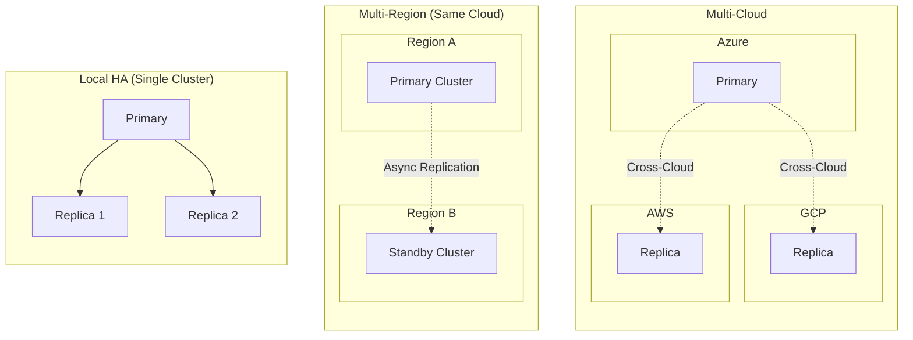
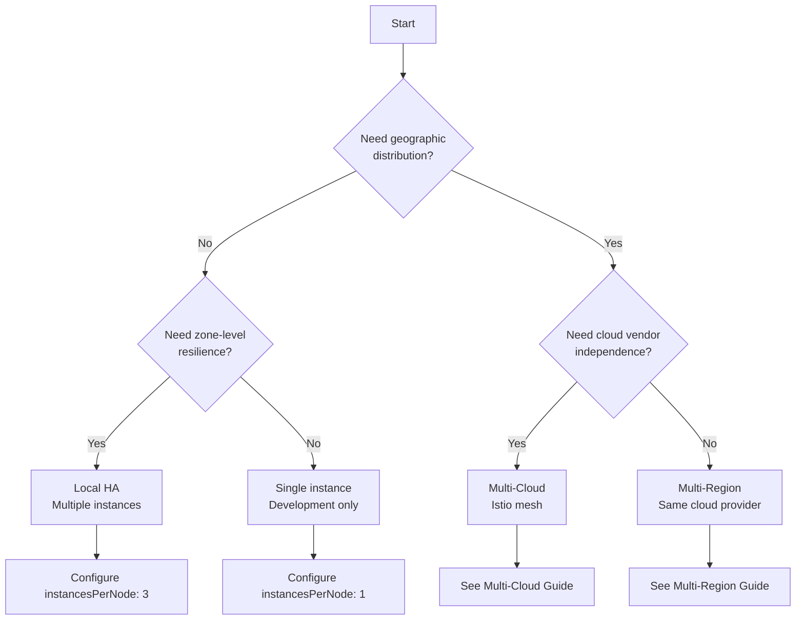

# High Availability Overview

High availability (HA) ensures your DocumentDB deployment remains accessible and operational despite component failures. This guide covers the HA options available and helps you choose the right approach for your requirements.

## What is High Availability?

High availability in DocumentDB means:

- **Automatic failover**: When a primary instance fails, a replica is automatically promoted
- **Data durability**: Data is replicated across multiple instances before acknowledging writes  
- **Minimal downtime**: Recovery happens automatically without manual intervention
- **Continuous operation**: Applications experience brief interruption rather than extended outages

## Types of High Availability

DocumentDB supports three levels of high availability, each providing different trade-offs between complexity, cost, and resilience:

### Local High Availability

Local HA runs multiple DocumentDB instances within a single Kubernetes cluster, distributed across availability zones.

| Aspect | Details |
|--------|---------|
| **Scope** | Single Kubernetes cluster |
| **Instances** | 1-3 instances (primary + replicas) |
| **Failover** | Automatic, typically < 30 seconds |
| **Data Loss** | Zero (synchronous replication) |
| **Use Case** | Standard production deployments |

**Best for:** Most production workloads requiring high availability without geographic distribution.

[Configure Local HA →](local-ha.md)

### Multi-Region Deployment

Multi-region runs DocumentDB clusters across multiple regions within the same cloud provider, connected via the cloud's native networking.

| Aspect | Details |
|--------|---------|
| **Scope** | Multiple regions, single cloud provider |
| **Networking** | Azure Fleet, VNet peering |
| **Failover** | Manual promotion required |
| **Data Loss** | Minimal (async replication lag) |
| **Use Case** | Disaster recovery, data locality |

**Best for:** Disaster recovery requirements, regulatory compliance requiring data in specific regions, or reducing latency for geographically distributed users.

### Multi-Cloud Deployment

Multi-cloud runs DocumentDB across different cloud providers (Azure, AWS, GCP), connected via service mesh.

| Aspect | Details |
|--------|---------|
| **Scope** | Multiple cloud providers |
| **Networking** | Istio service mesh |
| **Failover** | Manual promotion required |
| **Data Loss** | Minimal (async replication lag) |
| **Use Case** | Vendor independence, maximum resilience |

**Best for:** Organizations requiring cloud vendor independence, maximum disaster resilience, or hybrid cloud strategies.

## RTO and RPO Concepts

When planning for high availability, understand these key metrics:

### Recovery Time Objective (RTO)

**RTO** is the maximum acceptable time your application can be unavailable after a failure.

| HA Type | Typical RTO |
|---------|-------------|
| Local HA | < 30 seconds |
| Multi-Region | Minutes (manual failover) |
| Multi-Cloud | Minutes (manual failover) |

### Recovery Point Objective (RPO)

**RPO** is the maximum acceptable amount of data loss measured in time.

| HA Type | Typical RPO |
|---------|-------------|
| Local HA | 0 (synchronous) |
| Multi-Region | Seconds (replication lag) |
| Multi-Cloud | Seconds (replication lag) |

## Decision Tree

Use this guide to select the appropriate HA strategy:

## Trade-offs Summary

| Factor | Local HA | Multi-Region | Multi-Cloud |
|--------|----------|--------------|-------------|
| **Complexity** | Low | Medium | High |
| **Cost** | $ | $$ | $$$ |
| **RTO** | Seconds | Minutes | Minutes |
| **RPO** | Zero | Replication lag | Replication lag |
| **Blast radius** | Zone outage | Region outage | Cloud outage |
| **Network latency** | Minimal | Regional | Variable |

## Next Steps

- [Configure Local HA](local-ha.md) - Set up high availability within a single cluster
