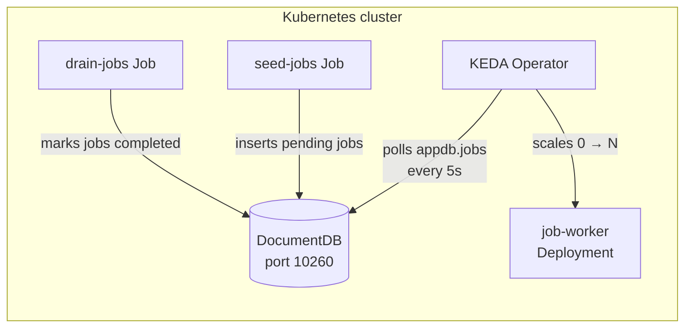

# KEDA autoscaling with DocumentDB

This playground demonstrates event-driven autoscaling using [KEDA](https://keda.sh/) with DocumentDB. KEDA's [MongoDB scaler](https://keda.sh/docs/2.19/scalers/mongodb/) polls a DocumentDB collection for pending jobs and automatically scales a worker Deployment from 0 to N pods based on the query result.

## Architecture



## Prerequisites

| Tool | Version | Purpose |
|------|---------|---------|
| [Kind](https://kind.sigs.k8s.io/) | 0.20+ | Local Kubernetes cluster |
| [kubectl](https://kubernetes.io/docs/tasks/tools/) | 1.30+ | Kubernetes CLI |
| [Helm](https://helm.sh/docs/intro/install/) | 3.x | Package manager for Kubernetes |
| DocumentDB operator | — | Must be running in the Kubernetes cluster |

> **Note:** If you don't have a Kubernetes cluster with the DocumentDB operator, use the
> [development deploy script](https://github.com/documentdb/documentdb-kubernetes-operator/blob/main/operator/src/scripts/development/deploy.sh)
> to set up Kind with the operator:
>
> ```bash
> cd operator/src
> DEPLOY=true DEPLOY_CLUSTER=true ./scripts/development/deploy.sh
> ```

## Quick start

```bash
# 1. Ensure the DocumentDB operator is running on your Kubernetes cluster

# 2. Deploy KEDA and the demo
cd documentdb-playground/keda-autoscaling
./scripts/setup.sh

# 3. Watch pods scale up (10 pending jobs trigger scaling)
kubectl get pods -n app -w

# 4. Drain jobs to scale back to 0
kubectl delete job drain-pending-jobs -n app --ignore-not-found
kubectl apply -f manifests/drain-jobs.yaml

# 5. Clean up
./scripts/teardown.sh
```

## How it works

1. **`setup.sh`** installs KEDA and deploys a DocumentDB instance with a worker Deployment.
2. A `ClusterTriggerAuthentication` stores the DocumentDB connection string (with TLS and auth parameters) in a Secret.
3. A `ScaledObject` configures KEDA to poll the `appdb.jobs` collection for documents matching `{"status": "pending"}` every 5 seconds.
4. When the number of pending jobs exceeds 5, KEDA creates an HPA that scales the `job-worker` Deployment from 0 up to 10 pods.
5. The **seed job** inserts 10 pending documents to trigger scaling.
6. The **drain job** updates all pending jobs to `"completed"`, causing KEDA to scale the Deployment back to 0 after the 30-second cooldown.

## Connection string configuration

The setup script builds a connection string for DocumentDB and stores it in a Kubernetes Secret:

```text
mongodb://<user>:<pass>@documentdb-service-keda-demo.documentdb-ns.svc.cluster.local:10260/?directConnection=true&authMechanism=SCRAM-SHA-256&tls=true&tlsAllowInvalidCertificates=true
```

| Parameter | Value | Why it's needed |
|-----------|-------|-----------------|
| Port | `10260` | DocumentDB Gateway port (not MongoDB's default 27017) |
| `directConnection=true` | Required | DocumentDB doesn't run a real replica set topology |
| `authMechanism=SCRAM-SHA-256` | Required | DocumentDB's authentication mechanism |
| `tls=true` | Required | DocumentDB Gateway serves TLS by default |
| `tlsAllowInvalidCertificates=true` | For self-signed | Skip certificate validation with the default self-signed certificates |

## Script reference

### `setup.sh`

Installs KEDA, deploys a DocumentDB instance, and configures the autoscaling demo.

| Environment variable | Description | Default |
|---------------------|-------------|---------|
| `DOCUMENTDB_NAMESPACE` | Namespace for the DocumentDB instance | `documentdb-ns` |
| `DOCUMENTDB_NAME` | DocumentDB instance name | `keda-demo` |
| `APP_NAMESPACE` | Namespace for KEDA resources and the worker | `app` |
| `KEDA_VERSION` | KEDA Helm chart version | `2.17.0` |

### `teardown.sh`

Removes demo resources. By default, KEDA and DocumentDB are preserved.

| Flag | Description |
|------|-------------|
| `--uninstall-keda` | Also uninstall the KEDA Helm release |
| `--delete-documentdb` | Also delete the DocumentDB instance |

### `demo.sh`

Interactive walkthrough that seeds jobs, watches scaling, drains jobs, and watches scale-down. Pauses between steps so you can observe the behavior.

## Manifest reference

| File | Description |
|------|-------------|
| `manifests/documentdb-instance.yaml` | DocumentDB CR (1 node, 2Gi storage) for Kind |
| `manifests/keda-trigger-auth.yaml` | `ClusterTriggerAuthentication` referencing the DocumentDB connection Secret |
| `manifests/keda-scaled-object.yaml` | `ScaledObject` with MongoDB trigger — polls `appdb.jobs` for pending documents |
| `manifests/job-worker.yaml` | Worker Deployment that KEDA scales (starts at 0 replicas) |
| `manifests/seed-jobs.yaml` | Job that inserts 10 pending documents into DocumentDB |
| `manifests/drain-jobs.yaml` | Job that marks all pending documents as completed |

## Known limitations and gotchas

> **Important:** KEDA's MongoDB scaler uses the Go MongoDB driver internally. The
> `tlsAllowInvalidCertificates=true` connection string parameter is respected by the driver, but
> if you encounter TLS errors, consider switching DocumentDB to `CertManager` TLS mode. See the
> [TLS configuration documentation](https://github.com/documentdb/documentdb-kubernetes-operator/blob/main/docs/operator-public-documentation/preview/configuration/tls.md).

> **Note:** The `directConnection=true` parameter is essential. Without it, the Go MongoDB driver
> attempts replica set discovery, which fails with DocumentDB because it doesn't expose a standard
> MongoDB replica set topology.

> **Note:** A `ClusterTriggerAuthentication` is used because the DocumentDB credentials Secret
> (`documentdb-ns`) and the ScaledObject (`app`) are in different namespaces. If you deploy
> everything in the same namespace, you can use a namespace-scoped `TriggerAuthentication` instead.

> **Note:** The `mongodb/mongodb-community-server:8.0-ubuntu2404` image is used for the seed and
> drain jobs because it includes `mongosh`. Any image with `mongosh` installed works.

## Cleanup

```bash
# Remove demo resources only (keep KEDA and DocumentDB)
./scripts/teardown.sh

# Remove everything including KEDA and DocumentDB
./scripts/teardown.sh --uninstall-keda --delete-documentdb
```

## Related resources

- [KEDA MongoDB scaler documentation](https://keda.sh/docs/2.19/scalers/mongodb/)
- [KEDA ScaledObject specification](https://keda.sh/docs/2.19/concepts/scaling-deployments/)
- [DocumentDB Kubernetes Operator documentation](https://documentdb.io/documentdb-kubernetes-operator/preview/)
- [Connecting to DocumentDB](https://github.com/documentdb/documentdb-kubernetes-operator/blob/main/docs/operator-public-documentation/preview/getting-started/connecting-to-documentdb.md)
- [DocumentDB TLS configuration](https://github.com/documentdb/documentdb-kubernetes-operator/blob/main/docs/operator-public-documentation/preview/configuration/tls.md)
